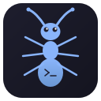

# Ants Terminal

<p align="center">
  
</p>

<p align="center">
  <strong>A real terminal emulator built from scratch in C++ with Qt6.</strong><br>
  No terminal libraries -- custom VT100/xterm parser, PTY management, and GPU-accelerated rendering.
</p>

<p align="center">
  <a href="#features">Features</a> &bull;
  <a href="#claude-code-integration">Claude Code</a> &bull;
  <a href="#building">Building</a> &bull;
  <a href="#keyboard-shortcuts">Shortcuts</a> &bull;
  <a href="#themes">Themes</a> &bull;
  <a href="#architecture">Architecture</a> &bull;
  <a href="#configuration">Configuration</a> &bull;
  <a href="PLUGINS.md">Plugins</a> &bull;
  <a href="ROADMAP.md">Roadmap</a> &bull;
  <a href="CHANGELOG.md">Changelog</a> &bull;
  <a href="#license">License</a>
</p>

<p align="center">
  Current version: <strong>0.7.31</strong> — see the <a href="CHANGELOG.md">CHANGELOG</a> for release notes, the <a href="ROADMAP.md">ROADMAP</a> for what's coming, and <a href="PLUGINS.md">PLUGINS</a> for the plugin authoring guide.
</p>

---

## Features

### Terminal Emulation

- **Real shell** -- spawns your login shell (bash, zsh, etc.) via `forkpty()` with full interactive support
- **VT100/xterm compatible** -- custom state machine parser based on the Paul Williams DEC model
- **UTF-8** -- complete 1-4 byte decoding with overlong rejection; invalid sequences replaced with U+FFFD
- **Alt screen buffer** -- vim, htop, less, nano, and other full-screen programs work correctly
- **Scrollback history** -- configurable up to 1,000,000 lines, navigable by mouse wheel or keyboard
- **Bracketed paste mode** -- supported for shells and editors that use it
- **Device Attributes** -- responds to DA1 (`CSI c`) and DA2 (`CSI > c`) queries
- **Cursor Position Report** -- responds to `CSI 6n` with current cursor position
- **Window title** -- reads OSC 0/2 title sequences from your shell prompt or running programs
- **Dynamic resize** -- window size changes propagate to the PTY via `SIGWINCH` with scrollback reflow

### GPU-Accelerated Rendering

Ants Terminal uses `QOpenGLWidget` for hardware-accelerated rendering out of the box. Two render paths are available:

- **QPainter (default)** -- GPU-accelerated 2D painting via Qt's OpenGL paint engine. Uses `QTextLayout` for proper font ligature shaping.
- **Custom GL Renderer** -- Optional glyph atlas-based renderer with GLSL 3.3 core shaders. Enable via `gpu_rendering: true` in config or Settings menu. Uses a 2048x2048 texture atlas with on-demand glyph rasterization, driver-safe texture swizzle for Intel/AMD compatibility, and per-vertex quad rendering. Note: ligatures are only available in the QPainter path.

### Ligature Support

Text is rendered using `QTextLayout` with HarfBuzz shaping, enabling proper ligatures in fonts like:
- **JetBrains Mono** -- `!=`, `<=`, `>=`, `->`, `=>`, `|>`
- **Fira Code** -- `www`, `::`, `===`, `!==`, `</>`, `<!--`

### Inline Graphics

| Protocol | Support |
|----------|---------|
| **Sixel** | Full DCS parser, two-pass rendering, 4096x4096 max, palette colors |
| **Kitty Graphics** | Chunked base64, PNG/RGBA/RGB, image cache (200 entries), transmit/display/delete |
| **iTerm2** | OSC 1337 inline images, cell-based sizing |

### Color Support

| Mode | Range | Description |
|------|-------|-------------|
| Standard ANSI | 16 colors | Overridable per theme |
| Extended 256 | 256 colors | 6x6x6 RGB cube + 24 grayscale |
| True Color | 16.7M colors | 24-bit RGB via `38;2;R;G;B` / `48;2;R;G;B` SGR |

Sets `TERM=xterm-256color` and `COLORTERM=truecolor` so programs detect capabilities automatically.

### Text Attributes

Bold, italic, underline, dim, inverse, and strikethrough -- all rendered natively with font variants and QPainter drawing.

### Advanced Underline Styles

| Style | SGR | Rendering |
|-------|-----|-----------|
| Single | `4` or `4:1` | Straight line |
| Double | `4:2` or `21` | Two parallel lines |
| Curly (undercurl) | `4:3` | Wavy/squiggly line |
| Dotted | `4:4` | Dotted line |
| Dashed | `4:5` | Dashed line |

Underline color is independently settable via `CSI 58;2;R;G;B m`. Used by Neovim for LSP diagnostic highlights.

### Unicode Support

- **UTF-8** -- complete 1-4 byte decoding with overlong encoding rejection
- **CJK double-width** -- `wcwidth()` detection, double-cell rendering
- **Combining characters** -- diacritical marks attached to base characters (e.g., e + combining acute = e)
- **Emoji** -- via font fallback (Noto Color Emoji, Symbola)

### Selection and Copy/Paste

- **Click and drag** to select text across lines
- **Alt+drag** for rectangular/column selection (great for `ls -l`, `ps aux`, log timestamps)
- **Double-click** to select a word
- **Triple-click** to select an entire line
- **Ctrl+Shift+C** to copy selection to clipboard
- **Ctrl+Shift+V** to paste text (or images) from clipboard
- **Middle-click** to paste the X11 primary selection
- **Shift+Enter** inserts a literal newline without executing (multi-line command editing)

### Image Paste (Claude Code Integration)

Paste images directly from the clipboard with **Ctrl+Shift+V**. Images are automatically saved as timestamped PNGs to `~/Pictures/ClaudePaste/` (configurable) and the **full filepath is inserted into the terminal** as text. This enables seamless screenshot sharing with Claude Code -- just paste and press Enter.

### URL Detection & Extended Hints Mode

URLs (`http://`, `https://`, `ftp://`, `file://`) are automatically detected, underlined, and colored with the theme accent. Hold **Ctrl** and the cursor changes to a pointing hand -- **Ctrl+Click** opens the URL in your default browser.

Applications can also emit **explicit hyperlinks** via the OSC 8 protocol (`ESC ] 8 ; params ; URI ST`). These take priority over regex-detected URLs.

Press **Ctrl+Shift+G** to enter **hints mode** -- all URLs, file paths, git SHAs, IP addresses, and email addresses on screen get labeled with a letter badge. Press the letter to open URLs, open file paths in your editor, or copy other patterns to clipboard.

### Search in Scrollback

Press **Ctrl+Shift+F** to open the search bar. All case-insensitive matches are highlighted across the entire scrollback and visible screen.

### Command Palette

Press **Ctrl+Shift+P** to open the command palette -- a searchable list of all available actions with their keyboard shortcuts. Type to filter, arrow keys to navigate, Enter to execute.

### Bracket Matching

When the cursor sits on a bracket character -- `(`, `)`, `[`, `]`, `{`, or `}` -- the matching bracket is highlighted with a subtle background.

### Line Bookmarks

Toggle bookmarks on any line with **Ctrl+Shift+B**. Navigate between bookmarks with **Ctrl+Shift+N** (next) and **Ctrl+Shift+K** (previous). Bookmarks are shown as colored dots in the left gutter.

### Prompt Navigation (OSC 133)

When your shell emits OSC 133 markers, jump between command prompts with **Ctrl+Shift+Up/Down**.

### Sticky Command Header

When scrolling through long command output, the command that produced it pins to the top of the viewport as a sticky header. Shows the command text and execution duration. Automatically uses OSC 133 shell integration markers.

### Command Timestamps & Duration

Each command prompt displays execution time (e.g. "2.3s") and timestamp (HH:mm:ss) in dim right-aligned text. Requires OSC 133 shell integration.

### Command Output Folding

Click the triangle indicator in the left gutter to collapse/expand completed command output blocks, or use **Ctrl+Shift+.**. Collapsed output shows a summary bar with line count.

### Scratchpad (Multi-line Command Editor)

Press **Ctrl+Shift+Enter** to open a floating text editor for composing complex multi-line commands. Write your pipeline or loop in the scratchpad, then press **Ctrl+Enter** to send it to the shell (uses bracketed paste for proper handling).

### Command Snippets Library

Press **Ctrl+Shift+;** to open the snippets dialog. Save frequently-used commands with names, descriptions, and `{{placeholder}}` parameters. When inserting a snippet, you're prompted for each placeholder value. Snippets are searchable and persist across sessions.

### Mouse Reporting

Full SGR mouse reporting for TUI applications:

- **Button events** (`?1000h`) -- press and release
- **Button+motion** (`?1002h`) -- drag tracking
- **Any motion** (`?1003h`) -- full mouse position tracking
- **SGR encoding** (`?1006h`) -- unlimited coordinates, explicit release

Hold **Shift** to override mouse reporting and use terminal selection instead.

### Focus Reporting

When enabled (`CSI ?1004h`), the terminal sends `CSI I` on focus gain and `CSI O` on focus loss.

### Synchronized Output

Applications can bracket rapid output updates with `CSI ?2026h` / `CSI ?2026l` to prevent screen tearing.

### Clipboard Access (OSC 52)

Remote applications can set the system clipboard via OSC 52 sequences. Clipboard read (query) is disabled for security.

### Session Recording

Record terminal sessions in **asciicast v2** format via **Ctrl+Shift+R** or the Settings menu. Recordings are saved to `~/.local/share/ants-terminal/recordings/` and can be played back with [asciinema](https://asciinema.org).

### Session Persistence

Enable in Settings to save terminal scrollback on exit and restore it on next launch. Session data is compressed and stored in `~/.local/share/ants-terminal/sessions/`.

### Per-Pixel Background Transparency

Two levels of transparency control:

- **Window Opacity** (View > Opacity) -- affects the entire window including title bar
- **Background Alpha** (View > Background Alpha) -- only the terminal background becomes transparent while text remains fully opaque. Works with KDE/KWin compositor blur.

### AI Assistant

Press **Ctrl+Shift+A** to open the AI assistant. Ask questions about terminal output, get command suggestions, or debug errors. Supports any OpenAI-compatible API endpoint (Ollama, LM Studio, OpenAI, Anthropic via proxy).

Configure in `config.json`:
```json
{
    "ai_endpoint": "http://localhost:11434/v1/chat/completions",
    "ai_model": "llama3",
    "ai_api_key": ""
}
```

Features:
- Streaming responses (SSE)
- Terminal context injection (last N lines)
- "Insert Command" button to paste AI suggestions into the terminal
- Works with local LLMs (no data leaves your machine with Ollama)

### SSH Manager

Press **Ctrl+Shift+S** to open the SSH manager. Manage connection bookmarks and connect to remote hosts.

Features:
- Quick connect bar (`user@host:port`)
- Bookmark management (save, edit, delete)
- Connect in new tab or current tab
- Identity file and extra SSH args support
- Passwords are never stored -- authentication is interactive

### Scriptable Plugin System (Lua)

Extend Ants Terminal with Lua plugins. Plugins react to terminal events and can send commands, show notifications, and modify behavior.

**Plugin API:**
```lua
-- ~/.config/ants-terminal/plugins/my-plugin/init.lua
ants.on("output", function(data)
    ants.log("Got output: " .. data)
end)

ants.on("keypress", function(key)
    -- Return false to cancel the keypress
    return true
end)

ants.send("echo hello")
ants.notify("Title", "Message")
ants.get_output(50)  -- Last 50 lines
ants.get_cwd()       -- Current directory
ants.set_status("Custom status text")
```

**Events:** `output`, `line`, `prompt`, `keypress`, `title_changed`, `tab_created`, `tab_closed`

**Security:** Plugins run in a sandbox with `os`, `io`, `debug`, `require`, `setmetatable`, `collectgarbage` removed. 10M instruction timeout prevents infinite loops (immune to `pcall` bypass). Memory capped at 10MB to prevent `string.rep` OOM attacks.

### Background Opacity & Blur

- **Opacity** -- adjustable from 70% to 100% via View menu (saved to config)
- **Background Alpha** -- per-pixel transparency from 50% to 100%
- **Translucent background** -- works with KDE Plasma / KWin compositor
- **Background blur** -- toggleable in Settings menu (requires compositor support)

### Project Audit Dialog

Press **Tools > Project Audit** to open a built-in static-analysis panel
over the current project. The dialog auto-detects language and framework
(C/C++, Qt, Python, JS/TS, Rust, Go, Shell, Lua, Java, Git) and runs a
catalogue of checks spanning general hygiene, security, and per-ecosystem
linters.

Highlights:

- **AST-aware Qt checks** via [clazy](https://github.com/KDE/clazy)
  (connect-3arg-lambda, container-inside-loop, old-style-connect, etc.) —
  reads `compile_commands.json` from the active build directory.
- **SonarQube-style taxonomy** — every finding carries a type
  (Info / CodeSmell / Bug / Hotspot / Vulnerability) and a 5-level
  severity (Info / Minor / Major / Critical / Blocker).
- **Per-finding dedup keys** (SHA-256 of file:line:checkId:title) power
  stable baselines, suppressions, and trend tracking across runs.
- **Baseline diff** — save current findings, later runs highlight only
  what's new; toggle "New since baseline" to hide known issues.
- **Trend tracking** — severity counts persisted at
  `.audit_cache/trend.json` (last 50 runs) and shown as a delta banner
  against the previous run.
- **Interactive suppression** — click the dedup-key hash next to any
  finding to add it (with an optional reason) to `.audit_suppress`.
  File format is JSONL: `{"key", "rule", "reason", "timestamp"}` per line.
- **User-defined rules** — drop an `audit_rules.json` at the project
  root to append or override checks without rebuilding the app. Schema
  matches the internal `AuditCheck` struct: `id`, `name`, `severity`,
  `type`, `command`, `drop_if_contains`, `keep_only_if_contains`,
  `drop_if_matches`, `max_lines`. User rules run through the full
  filter / parse / dedup / suppress pipeline like built-ins.
- **Recent-changes scope** — toggle to restrict findings to files
  touched in the last 10 commits, or the stricter "Changed lines only"
  toggle which filters to exact diff hunk ranges (what CI pre-merge
  review would flag).
- **Multi-tool correlation** — a ★ badge appears on findings that two
  or more distinct tools flag at the same `file:line`. Orthogonal to
  severity; surfaces cross-validated hits above single-tool noise.
- **Confidence score (0-100)** — weighted sum of severity, cross-tool
  agreement, tool class (AST-aware vs. regex), and path heuristics
  (test files and generated code shed confidence). Shown as a coloured
  pip next to every finding; toggle "Sort by confidence" to surface
  the most trustworthy findings first.
- **Comment/string-aware filtering** — grep-style pattern checks run
  a tiny state-machine over the source to drop matches that live in
  `//` comments, `/* */` blocks, or `"string literals"`.
- **Inline suppression directives** — recognises ants-native
  `// ants-audit: disable[=rule-id]` (same line), `disable-next-line`
  (line above), and `disable-file` (first 20 lines), plus pass-through
  for every major tool's native markers: clang-tidy `NOLINT` /
  `NOLINTNEXTLINE`, cppcheck `cppcheck-suppress`, flake8 `noqa`,
  bandit `nosec`, semgrep `nosemgrep`, gitleaks `#gitleaks:allow`,
  eslint `eslint-disable-*`, pylint `pylint: disable`.
- **Generated-file auto-skip** — findings in `moc_*`, `ui_*`, `qrc_*`,
  `*.pb.cc` / `*.pb.h`, `/generated/` paths, and `*_generated.*` files
  are dropped silently. Stops Qt MOC output and protobuf-generated
  code from drowning the report.
- **Path-based rules** — extend `audit_rules.json` with `path_rules[]`
  entries to shift severity or skip findings by glob, e.g. lowering
  everything under `tests/**` by one severity band or skipping every
  `**/moc_*.cpp`.
- **Code snippet context (±3 lines)** — every finding with a
  `file:line` expands on click to show the surrounding lines, with
  the finding line highlighted. SARIF export includes this as
  `physicalLocation.contextRegion` (consumed by GitHub Code Scanning
  and VSCode's SARIF Viewer natively).
- **Git blame enrichment** — each finding is tagged with the last
  author, author date, and short SHA. Cached per `(file, line)` so
  the enrichment pass adds 1-2s to a run on a 50-finding audit.
- **AI triage (optional)** — click "🧠 Triage with AI" on any
  expanded finding to send the rule, message, snippet, and blame to
  the project's configured OpenAI-compatible endpoint (the same one
  powering the AI assistant). The response is parsed as
  `{verdict, confidence, reasoning}` and displayed inline as a
  coloured verdict badge.
- **Live filter + severity pills** — filter findings across all
  checks by text (matches file, message, rule, author) or toggle
  severity pills to hide whole categories. "Sort by confidence"
  reorders every check's findings by their computed confidence.
- **Semgrep integration (optional)** — when `semgrep` is installed,
  a Security-category check runs `p/security-audit` + language-
  specific community rule packs. Adds structural pattern matching
  beyond grep for cross-cutting vulnerability families; complements
  clazy's Qt-aware AST checks.
- **Exports** — SARIF v2.1.0 (OASIS standard, consumed by GitHub Code
  Scanning / VSCode SARIF Viewer / SonarQube) with `contextRegion`
  and `properties.blame` bag populated; single-file HTML report with
  severity filter pills, text search, collapsible check cards,
  inline snippet reveal, and verdict badges (no external assets).
- **Claude review handoff** — "Review with Claude" emits a plain-text
  report with snippets and confidence/blame/verdict tags, plus
  `CLAUDE.md`, `STANDARDS.md`, `RULES.md`, and `CONTRIBUTING.md`
  prepended, then signals the main window to open a Claude Code
  session on the report.

Sample `audit_rules.json` showing the full schema:

```json
{
  "version": 1,
  "rules": [
    {
      "id": "no-std-cout",
      "name": "Direct std::cout in production code",
      "description": "Use qDebug() or the logging subsystem instead",
      "category": "Project",
      "severity": "minor",
      "type": "smell",
      "command": "grep -rnI --include='*.cpp' --include='*.h' -E 'std::cout\\s*<<' src/",
      "auto_select": true,
      "max_lines": 50,
      "drop_if_contains": ["// allow-cout", "example", "debug only"]
    }
  ],
  "path_rules": [
    { "glob": "tests/**",           "severity_shift": -2 },
    { "glob": "**/moc_*.cpp",       "skip": true },
    { "glob": "third_party/**",     "skip": true },
    { "glob": "src/legacy/**",      "severity_shift": -1, "skip_rules": ["memory_patterns"] }
  ]
}
```

Inline suppression examples:

```cpp
// ants-audit: disable-file=secrets_scan
const char *kDemoToken = "dummy-token-for-demo";   // ants-audit: disable=secrets_scan
auto *raw = new char[N];                           // NOLINT(cppcoreguidelines-owning-memory)
// ants-audit: disable-next-line
printf(userInput);
```

### Claude Code Integration

Deep integration with [Claude Code](https://claude.ai/claude-code) for AI-assisted development workflows.

**Live Status Monitoring** -- The status bar shows Claude's current state (idle, thinking, bash, reading a file, editing, searching, planning, auditing, prompting, compacting) with context window usage. Process detection via `/proc` polling automatically tracks running Claude sessions; transcript state is derived from `~/.claude/projects/<encoded-cwd>/*.jsonl` via an inotify watcher with a 50 ms debounce.

**Real-time status hooks (opt-in)** -- For sub-second state transitions, install the Claude Code hooks from **Settings > General > Claude Code > Install Claude Code status-bar hooks**. That one-click action writes:

1. A helper script at `~/.config/ants-terminal/hooks/claude-forward.sh` that reads a hook-event JSON from stdin, walks up the process tree to find the parent `ants-terminal`, and forwards the event to that instance's Unix socket (`/tmp/ants-claude-hooks-<pid>`).
2. Hook entries in `~/.claude/settings.json` under `"hooks"` for `SessionStart`, `PreToolUse`, `PostToolUse`, `Stop`, and `PreCompact`, each pointing at the helper script.

Existing hooks you have configured (e.g. `UserPromptSubmit`) are preserved -- the installer only appends, and it's idempotent (re-running won't double-wire the same events). Without hooks installed, Ants Terminal falls back to the transcript-file watcher path and still delivers updates within ~100 ms of each event.

**Project & Session Browser** (**Ctrl+Shift+J**) -- Browse all your Claude Code projects discovered from `~/.claude/projects/`. For each project, see every session with its first message summary, timestamp, file size, and active status. Resume any session, continue the latest, or fork a session -- all directly from the terminal.

**Permission Allowlist Editor** (**Ctrl+Shift+L**) -- Visual editor for `.claude/settings.local.json` permission rules. Add, remove, and organize allow/deny/ask rules with preset suggestions for common tools (git, npm, cargo, etc.). Changes are written atomically with proper file permissions.

**Session Transcript Viewer** -- Read-only viewer for Claude Code JSONL transcripts. Displays user messages, assistant responses, tool calls, and token usage in a formatted HTML view.

**Slash Command Shortcuts** -- Quick menu entries for sending `/compact`, `/clear`, `/cost`, `/help`, and `/status` to a running Claude session.

**Project Directory Management** -- Configure directories where new Claude Code projects can be created. Start new projects in any managed directory directly from the Projects dialog.

### Configurable Keybindings

All keyboard shortcuts can be customized via the `keybindings` section in `config.json`.

### Font Fallback & Nerd Font Symbols

The terminal automatically detects and uses fallback fonts for characters not available in the primary font. **Nerd Font symbols** (Powerline, Devicons, etc.) are automatically detected -- if you have any Nerd Font installed, Powerline prompts and Starship icons will render correctly even without using a patched font as your primary font.

### Tab/Pane Badges

Set a badge text in Settings > Appearance to display a large, semi-transparent watermark in the terminal background. Useful for identifying terminals at a glance (e.g., showing hostname, project name, or environment).

### Dark/Light Auto-Switching

Enable "Auto-switch theme with system dark/light mode" in Settings > Appearance. Configure separate themes for dark and light modes -- the terminal automatically switches when your system color scheme changes.

### Auto Profile Switching

Configure rules in `auto_profile_rules` to automatically switch terminal profiles based on patterns. Match against window title, current directory, or foreground process. Useful for changing appearance when SSHing to production or switching to root.

### Hot-Reload Configuration

Edit `~/.config/ants-terminal/config.json` externally and changes are applied instantly without restarting. Theme, fonts, keybindings, opacity, and all other settings update live.

### 11 Built-in Themes

Switch themes from the **View** menu. Your choice is saved between sessions.

| Theme | Background | Accent | Style |
|-------|-----------|--------|-------|
| **Dark** (default) | `#1E1E2E` | `#89B4FA` | Catppuccin Mocha |
| **Light** | `#FFFFFF` | `#1A73E8` | Clean light |
| **Nord** | `#2E3440` | `#88C0D0` | Arctic, blue-green |
| **Dracula** | `#282A36` | `#BD93F9` | Purple accent |
| **Monokai** | `#272822` | `#66D9EF` | Warm classic |
| **Solarized Dark** | `#002B36` | `#268BD2` | Ethan Schoonover |
| **Gruvbox** | `#282828` | `#FABD2F` | Retro warm |
| **Tokyo Night** | `#1A1B26` | `#7AA2F7` | Japanese cityscape |
| **Catppuccin Latte** | `#EFF1F5` | `#1E66F5` | Pastel light |
| **One Dark** | `#282C34` | `#61AFEF` | Atom editor |
| **Kanagawa** | `#1F1F28` | `#7E9CD8` | Muted Japanese |

### Window Management

- **Persistent geometry** -- window size and position saved/restored between sessions
- **Center window** -- **Ctrl+Shift+M** or View menu
- **Zoom** -- **Ctrl+=** / **Ctrl+-** / **Ctrl+0** (8pt to 32pt range)
- **Tabs** -- Ctrl+Shift+T/W for new/close
- **Split panes** -- horizontal (Ctrl+Shift+E) and vertical (Ctrl+Shift+O)

---

## Building

### Dependencies

| Dependency | Version | Notes |
|-----------|---------|-------|
| C++ compiler | C++20 (GCC 12+, Clang 15+) | |
| Qt6 | 6.x | Core, Gui, Widgets, Network, OpenGL, OpenGLWidgets |
| CMake | 3.20+ | |
| libutil | -- | Included with glibc (provides `forkpty`) |
| Lua 5.4 | 5.4.x | Optional -- enables plugin system |
| clazy | 1.17+ | Optional -- enables Qt-aware AST checks in the Project Audit dialog |
| semgrep | 1.0+ | Optional -- enables structural pattern matching (`p/security-audit` + language packs) in the Project Audit dialog |
| cppcheck / clang-tidy / shellcheck / pylint / bandit / ruff | any | Optional -- each enables the matching ecosystem check if installed |

### Install Dependencies

**openSUSE Tumbleweed:**
```bash
sudo zypper install qt6-base-devel cmake gcc-c++ lua54-devel
```

**Ubuntu / Debian:**
```bash
sudo apt install qt6-base-dev libqt6opengl6-dev cmake g++ liblua5.4-dev
```

**Fedora:**
```bash
sudo dnf install qt6-qtbase-devel cmake gcc-c++ lua-devel
```

**Arch Linux:**
```bash
sudo pacman -S qt6-base cmake gcc lua
```

### Compile

```bash
git clone https://github.com/milnet01/ants-terminal.git
cd ants-terminal
mkdir build && cd build
cmake ..
make -j$(nproc)
```

### Run

```bash
./ants-terminal
```

### Tests

```bash
cd build && ctest --output-on-failure
```

Runs `tests/audit_self_test.sh`, which asserts each audit rule's grep
pattern matches exactly the expected lines in its fixture `bad.*` and
nothing in its `good.*`. Takes ~40 ms. Extend by adding a new
`tests/audit_fixtures/<rule-id>/` directory and a `run_rule` entry in
the shell script.

### Install System-wide

```bash
sudo cmake --install build   # installs to /usr/local by default
```

That picks up every install rule in `CMakeLists.txt`:

| Path | What |
|------|------|
| `<prefix>/bin/ants-terminal` | Binary |
| `<prefix>/share/applications/org.ants.Terminal.desktop` | App-menu entry |
| `<prefix>/share/metainfo/org.ants.Terminal.metainfo.xml` | AppStream metadata (GNOME Software, KDE Discover) |
| `<prefix>/share/icons/hicolor/<size>/apps/ants-terminal.png` | Icon at six sizes (16/32/48/64/128/256) |
| `<prefix>/share/man/man1/ants-terminal.1` | Section-1 manual page (`man ants-terminal`) |
| `<prefix>/share/bash-completion/completions/ants-terminal` | Bash tab-completion |
| `<prefix>/share/zsh/site-functions/_ants-terminal` | Zsh tab-completion |
| `<prefix>/share/fish/vendor_completions.d/ants-terminal.fish` | Fish tab-completion |

Distros should stage into a build root with `DESTDIR=…` (all rules use
`GNUInstallDirs`, so Debian/Fedora/openSUSE/Arch packaging tooling
works without patches).

### Desktop Entry for development (run uninstalled)

If you prefer to run straight out of the build tree without a
system install, `ants-terminal.desktop.in` is a template that points at
your checkout via `launch.sh`:

```bash
# From the repo root:
sed "s|@INSTALL_DIR@|$PWD|" ants-terminal.desktop.in > ants-terminal.desktop
cp ants-terminal.desktop ~/.local/share/applications/
cp assets/ants-terminal-256.png ~/.local/share/icons/hicolor/256x256/apps/ants-terminal.png
```

The generated `ants-terminal.desktop` is git-ignored since it contains a
machine-specific path. The packaged entry under `packaging/linux/` is
the one distros ship.

---

## Keyboard Shortcuts

### General

| Shortcut | Action |
|----------|--------|
| Ctrl+Shift+N | New window |
| Ctrl+Shift+Q | Quit |
| Ctrl+Shift+P | Command palette |

### Editing

| Shortcut | Action |
|----------|--------|
| Shift+Enter | Insert literal newline (multi-line editing) |
| Ctrl+Shift+C | Copy selection to clipboard |
| Ctrl+Shift+V | Paste from clipboard (text or image with auto-save) |
| Ctrl+Shift+U | Clear entire input line |
| Middle-click | Paste X11 primary selection |
| Alt+Drag | Rectangular/column selection |
| Ctrl+Shift+Enter | Open scratchpad (multi-line command editor) |
| Ctrl+Enter | Send scratchpad command (inside scratchpad) |

### Navigation

| Shortcut | Action |
|----------|--------|
| Mouse wheel | Scroll through history |
| Shift+Page Up/Down | Scroll by screen |
| Shift+Home/End | Scroll to top/bottom |
| Ctrl+Shift+Up/Down | Jump to prev/next prompt (OSC 133) |
| Ctrl+Shift+B | Toggle line bookmark |
| Ctrl+Shift+N/K | Next/previous bookmark |

### Search

| Shortcut | Action |
|----------|--------|
| Ctrl+Shift+F | Open search bar |
| Enter | Next match |
| Shift+Enter | Previous match |
| Escape | Close search bar |

### View

| Shortcut | Action |
|----------|--------|
| Ctrl+= | Zoom in |
| Ctrl+- | Zoom out |
| Ctrl+0 | Reset zoom (11pt) |
| Ctrl+Shift+M | Center window on screen |

### Tabs & Splits

| Shortcut | Action |
|----------|--------|
| Ctrl+Shift+T | New tab |
| Ctrl+Shift+W | Close tab |
| Ctrl+Shift+E | Split horizontal |
| Ctrl+Shift+O | Split vertical |
| Ctrl+Shift+X | Close focused pane |

### Tools

| Shortcut | Action |
|----------|--------|
| Ctrl+Shift+A | AI Assistant |
| Ctrl+Shift+S | SSH Manager |
| Ctrl+Shift+R | Toggle session recording |
| Ctrl+Shift+G | Extended hints mode (URLs, SHAs, IPs, emails) |
| Ctrl+Shift+; | Command snippets library |
| Ctrl+Shift+. | Toggle command output fold |
| Ctrl+Shift+J | Claude Code Projects & Sessions |
| Ctrl+Shift+L | Claude Code Allowlist Editor |

---

## Themes

Themes are selectable from the **View > Themes** menu. Each theme defines:

- Primary and secondary background colors
- Primary and secondary text colors
- Accent and border colors
- Cursor color
- Full ANSI 16-color palette (colors 0-15)

---

## Architecture

```
┌──────────┐     ┌──────────┐     ┌──────────────┐     ┌────────────────┐
│ Keyboard │────>│   PTY    │────>│   Shell      │────>│   PTY          │
│ / Mouse  │     │ (master) │     │ (bash/zsh)   │     │ (master read)  │
└──────────┘     └──────────┘     └──────────────┘     └───────┬────────┘
                                                               │
                                                               v
                                                        ┌──────────┐
                                                        │ VtParser │
                                                        │ State    │
                                                        │ machine  │
                                                        └────┬─────┘
                                                             │ VtAction
                                                             v
                                                      ┌──────────────┐
                                                      │TerminalGrid  │
                                                      │ Cells +      │
                                                      │ scrollback   │
                                                      └──────┬───────┘
                                                             │
                                          ┌──────────────────┼──────────────────┐
                                          v                  v                  v
                                   ┌──────────┐     ┌──────────────┐    ┌──────────┐
                                   │ QPainter │     │ GlRenderer   │    │ Session  │
                                   │ (CPU)    │     │ (GPU/OpenGL) │    │ Manager  │
                                   └──────────┘     └──────────────┘    └──────────┘
```

### Components

| Component | File | Responsibility |
|-----------|------|----------------|
| **Pty** | `ptyhandler.h/cpp` | Spawns shell via `forkpty()`, non-blocking I/O, PTY resize |
| **VtParser** | `vtparser.h/cpp` | DEC VT100/xterm state machine, UTF-8 decoding, emits VtActions |
| **TerminalGrid** | `terminalgrid.h/cpp` | Cell buffer, scrollback, cursor, ANSI colors, alt screen, Sixel/Kitty |
| **TerminalWidget** | `terminalwidget.h/cpp` | QOpenGLWidget rendering, input, selection, search, URLs |
| **GlRenderer** | `glrenderer.h/cpp` | OpenGL glyph atlas, GLSL 3.3 shaders, per-vertex rendering |
| **MainWindow** | `mainwindow.h/cpp` | Window chrome, menus, themes, config, dialogs |
| **AiDialog** | `aidialog.h/cpp` | AI chat dialog, OpenAI API, streaming SSE |
| **SshDialog** | `sshdialog.h/cpp` | SSH bookmark manager, connection via PTY |
| **SessionManager** | `sessionmanager.h/cpp` | Scrollback serialization, save/restore |
| **LuaEngine** | `luaengine.h/cpp` | Embedded Lua 5.4, sandboxed API, event handlers |
| **PluginManager** | `pluginmanager.h/cpp` | Plugin discovery, loading, lifecycle |
| **CommandPalette** | `commandpalette.h/cpp` | Searchable action overlay (Ctrl+Shift+P) |
| **TitleBar** | `titlebar.h/cpp` | Custom frameless title bar with drag support |
| **XcbPositionTracker** | `xcbpositiontracker.h/cpp` | Window position tracking via KWin scripting |
| **ClaudeIntegration** | `claudeintegration.h/cpp` | Claude Code process detection, status, hooks |
| **ClaudeProjects** | `claudeprojects.h/cpp` | Project/session browser and resume dialog |
| **ClaudeAllowlist** | `claudeallowlist.h/cpp` | Permission rule editor for Claude settings |
| **ClaudeTranscript** | `claudetranscript.h/cpp` | Session transcript viewer |
| **AuditDialog** | `auditdialog.h/cpp` | Static analysis panel, SARIF/HTML export, baseline diff, trend tracking |
| **Themes** | `themes.h/cpp` | 7 color themes with ANSI palette overrides |
| **Config** | `config.h/cpp` | JSON config persistence (0600 perms) |

---

## Supported Escape Sequences

### CSI Sequences (`ESC [`)

| Code | Name | Description |
|------|------|-------------|
| A | CUU | Cursor up |
| B | CUD | Cursor down |
| C | CUF | Cursor forward |
| D | CUB | Cursor backward |
| E | CNL | Cursor next line |
| F | CPL | Cursor previous line |
| G | CHA | Cursor horizontal absolute |
| H | CUP | Cursor position |
| J | ED | Erase in display (0/1/2/3) |
| K | EL | Erase in line (0/1/2) |
| L | IL | Insert lines |
| M | DL | Delete lines |
| P | DCH | Delete characters |
| S | SU | Scroll up |
| T | SD | Scroll down |
| X | ECH | Erase characters |
| @ | ICH | Insert blank characters |
| d | VPA | Vertical position absolute |
| f | HVP | Horizontal/vertical position |
| m | SGR | Select graphic rendition |
| c | DA | Device attributes (DA1/DA2 responses) |
| n | DSR | Device status report |
| r | DECSTBM | Set scrolling region |
| s | DECSC | Save cursor position |
| u | DECRC | Restore cursor position |

### Private Modes (`ESC [ ? ... h/l`)

| Mode | Description |
|------|-------------|
| 1 | Application cursor keys |
| 6 | Origin mode |
| 7 | Auto-wrap mode |
| 25 | Cursor visibility |
| 47/1047/1049 | Alt screen buffer |
| 1000 | Mouse button reporting |
| 1002 | Mouse button+motion reporting |
| 1003 | Mouse any-motion reporting |
| 1004 | Focus reporting |
| 1006 | SGR mouse encoding |
| 2004 | Bracketed paste mode |
| 2026 | Synchronized output |

### OSC Sequences (`ESC ]`)

| Code | Description |
|------|-------------|
| 0/2 | Set window title |
| 8 | Hyperlinks (open/close explicit links) |
| 52 | Clipboard access (write only) |
| 133 | Shell integration (A/B/C/D markers) |
| 1337 | iTerm2 inline images |

### DCS / APC Sequences

| Protocol | Description |
|----------|-------------|
| DCS (Sixel) | Sixel graphics with palette, RLE, raster attributes |
| APC (Kitty) | Kitty graphics protocol with chunked transmission |

---

## Configuration

Config is stored at `~/.config/ants-terminal/config.json` with **0600** file permissions.

```json
{
    "theme": "Dark",
    "font_size": 11,
    "opacity": 1.0,
    "scrollback_lines": 50000,
    "auto_copy_on_select": true,
    "session_logging": false,
    "background_blur": false,
    "gpu_rendering": false,
    "session_persistence": true,
    "image_paste_dir": "",
    "editor_command": "",
    "ai_endpoint": "",
    "ai_api_key": "",
    "ai_model": "llama3",
    "ai_context_lines": 50,
    "ai_enabled": false,
    "ssh_bookmarks": [],
    "plugin_dir": "",
    "enabled_plugins": [],
    "claude_project_dirs": [],
    "keybindings": {},
    "snippets": [],
    "auto_profile_rules": [],
    "badge_text": "",
    "auto_color_scheme": false,
    "dark_theme": "Dark",
    "light_theme": "Light"
}
```

| Key | Type | Default | Description |
|-----|------|---------|-------------|
| `theme` | string | `"Dark"` | Active theme name |
| `font_size` | int | `11` | Font size in points (4-48) |
| `opacity` | double | `1.0` | Terminal-area opacity (0.1-1.0); chrome stays opaque |
| `scrollback_lines` | int | `50000` | Max scrollback lines (1000-1000000) |
| `auto_copy_on_select` | bool | `true` | Copy to clipboard on text selection |
| `session_logging` | bool | `false` | Log raw session to file |
| `background_blur` | bool | `false` | Enable KWin background blur |
| `gpu_rendering` | bool | `false` | Use OpenGL glyph atlas renderer |
| `session_persistence` | bool | `true` | Save/restore scrollback across restarts |
| `image_paste_dir` | string | `""` | Image paste save directory |
| `editor_command` | string | `""` | Editor for file path clicking |
| `ai_endpoint` | string | `""` | OpenAI-compatible API URL |
| `ai_api_key` | string | `""` | API key for AI endpoint |
| `ai_model` | string | `"llama3"` | LLM model to use |
| `ai_context_lines` | int | `50` | Lines of terminal output sent to AI |
| `ai_enabled` | bool | `false` | Enable AI assistant features |
| `ssh_bookmarks` | array | `[]` | Saved SSH connection bookmarks |
| `plugin_dir` | string | `""` | Lua plugin directory |
| `enabled_plugins` | array | `[]` | List of enabled plugin names |
| `claude_project_dirs` | array | `[]` | Directories for Claude Code projects |
| `keybindings` | object | `{}` | Custom keybindings (action -> key) |
| `snippets` | array | `[]` | Saved command snippets with placeholders |
| `auto_profile_rules` | array | `[]` | Auto profile switch rules |
| `badge_text` | string | `""` | Watermark text in terminal background |
| `auto_color_scheme` | bool | `false` | Auto dark/light theme switching |
| `dark_theme` | string | `"Dark"` | Theme for dark system mode |
| `light_theme` | string | `"Light"` | Theme for light system mode |

---

## Plugins

See [**PLUGINS.md**](PLUGINS.md) for the full plugin-authoring guide,
API reference, event list, sandbox boundaries, resource limits, and
forward-compatibility notes. Quick-start:

1. Create a directory: `~/.config/ants-terminal/plugins/my-plugin/`
2. Create `init.lua`:

```lua
ants.log("My plugin loaded!")

ants.on("prompt", function(data)
    ants.notify("Prompt", "New command prompt")
end)
```

3. Optionally create `manifest.json`:

```json
{
    "name": "My Plugin",
    "version": "1.0.0",
    "description": "Does cool things",
    "author": "Your Name"
}
```

### Plugin API (summary)

| Function | Description |
|----------|-------------|
| `ants.on(event, callback)` | Register event handler |
| `ants.send(text)` | Send text to terminal PTY |
| `ants.notify(title, message)` | Show desktop notification |
| `ants.get_output(n)` | Get last N lines of output |
| `ants.get_cwd()` | Get current working directory |
| `ants.set_status(text)` | Set status bar text |
| `ants.log(message)` | Log message to status bar |

Full signatures, return values, examples, and planned additions (0.6
capability manifest, 0.7 triggers, 0.8 marketplace) live in
[PLUGINS.md](PLUGINS.md).

### Events

| Event | Data | Description |
|-------|------|-------------|
| `output` | Raw bytes | PTY data received |
| `line` | Line text | Complete line received |
| `prompt` | -- | OSC 133 prompt detected |
| `keypress` | Key name | Before key sent to PTY (return false to cancel) |
| `title_changed` | Title | Window title changed |
| `tab_created` | -- | New tab created |
| `tab_closed` | -- | Tab closed |

---

## Security

- **Config file permissions**: created with `0600` (owner read/write only)
- **No network access** by default -- AI assistant requires explicit configuration
- **OSC 52 clipboard**: write-only -- read disabled
- **Lua sandbox**: dangerous functions removed, 10M instruction timeout (pcall-proof), 10MB memory limit
- **SSH**: no password storage, interactive authentication only
- **AI**: API keys stored in 0600-permission config, 30-second network timeout
- **Session files**: bounds-validated on load, 100MB compressed size limit
- **Buffer limits**: CSI params capped at 32, images capped at 100+200, combining chars at 8
- **UTF-8 security**: overlong encodings, surrogates, out-of-range rejected
- **Bracketed paste**: prevents clipboard injection attacks

---

## Project Structure

```
ants-terminal/
├── CMakeLists.txt              # Build configuration
├── README.md                   # This file
├── LICENSE                     # MIT License
├── CLAUDE.md                   # Development context
├── STANDARDS.md                # Coding standards
├── RULES.md                    # Development rules
├── launch.sh                   # Self-locating launcher wrapper
├── ants-terminal.desktop.in    # Desktop entry template (@INSTALL_DIR@)
├── assets/                     # App icons (16-256px PNGs)
├── packaging/linux/            # Spec-compliant .desktop + AppStream metainfo
└── src/
    ├── main.cpp                # Entry point, OpenGL format setup
    ├── mainwindow.h/cpp        # Window, menus, themes, dialogs
    ├── titlebar.h/cpp          # Custom frameless title bar
    ├── terminalwidget.h/cpp    # Rendering, input, selection, search
    ├── terminalgrid.h/cpp      # Cell grid, scrollback, VtAction processing
    ├── vtparser.h/cpp          # VT100/xterm state machine, UTF-8 decoder
    ├── ptyhandler.h/cpp        # PTY via forkpty(), QSocketNotifier I/O
    ├── themes.h/cpp            # 7 color themes with ANSI palettes
    ├── config.h/cpp            # JSON config persistence (0600 perms)
    ├── commandpalette.h/cpp    # Searchable command palette overlay
    ├── glrenderer.h/cpp        # OpenGL glyph atlas + shader renderer
    ├── sessionmanager.h/cpp    # Session save/restore
    ├── aidialog.h/cpp          # AI assistant (OpenAI API)
    ├── sshdialog.h/cpp         # SSH bookmark manager
    ├── xcbpositiontracker.h/cpp # KWin window position tracking
    ├── claudeintegration.h/cpp # Claude Code status, hooks, MCP
    ├── claudeprojects.h/cpp    # Claude Code project/session browser
    ├── claudeallowlist.h/cpp   # Claude Code permission editor
    ├── claudetranscript.h/cpp  # Claude Code transcript viewer
    ├── auditdialog.h/cpp       # Project audit panel + SARIF/HTML export
    ├── luaengine.h/cpp         # Lua 5.4 scripting engine
    └── pluginmanager.h/cpp     # Plugin discovery + loading

tests/
├── audit_self_test.sh         # CTest regression harness for audit rule patterns
└── audit_fixtures/            # Per-rule bad.*/good.* fixture pairs with @expect markers
```

---

## Contributing

Contributions are welcome! This project is built from scratch with no terminal library dependencies, so understanding the VT100 state machine and PTY layer is helpful context.

Before contributing, please read [`CONTRIBUTING.md`](CONTRIBUTING.md) (build + PR conventions) and [`CODE_OF_CONDUCT.md`](CODE_OF_CONDUCT.md) (Contributor Covenant 2.1). Security issues and conduct reports go through the private channels documented in [`SECURITY.md`](SECURITY.md) and [`CODE_OF_CONDUCT.md`](CODE_OF_CONDUCT.md) respectively — not public GitHub issues.

1. Fork the repository
2. Create a feature branch
3. Make your changes
4. Build and test: `mkdir build && cd build && cmake .. && make -j$(nproc)`
5. Submit a pull request

---

## License

[MIT License](LICENSE) -- Copyright (c) 2026 Ants Terminal Contributors
