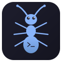

# Ants Terminal

<p align="center">
  
</p>

<p align="center">
  <strong>A fast, modern terminal that makes Claude Code cheaper and easier to use.</strong>
</p>

<p align="center">
  <a href="#what-is-this">What is this?</a> &bull;
  <a href="#why-use-it-with-claude-code">Why use it with Claude Code</a> &bull;
  <a href="#install">Install</a> &bull;
  <a href="#settings">Settings</a> &bull;
  <a href="#for-developers">For developers</a>
</p>

<p align="center">
  Version <strong>0.7.102</strong> ·
  <a href="CHANGELOG.md">What's new</a> ·
  <a href="ROADMAP.md">What's planned</a>
</p>

---

## What is this?

A **terminal** is the window where you type commands to your computer. Ants
Terminal is a fast, good-looking one for Linux — but its real party trick is
that it works hand-in-hand with [Claude Code](https://claude.ai/claude-code),
Anthropic's AI coding assistant, to **save you money** and make sessions
smoother.

It's built from scratch (the only thing it needs to run is Qt6), so it's
quick and light, and everything it does for Claude happens **on your own
machine** — nothing is sent anywhere.

## Why use it with Claude Code

Claude Code charges by the **token** — think of a token as a small chunk of
text it reads or writes. Every time Claude runs a command to look something
up (checking what changed in your code, searching files, reading a long
to-do list), it reads all that output, and you pay for it.

Ants Terminal answers a lot of those questions **itself** and hands Claude a
short, tidy summary instead of a wall of text. Less text read means fewer
tokens spent. Three things make that happen:

- **A built-in toolkit Claude can use.** 87 ready-made tools that answer
  Claude's common questions directly — often saving thousands of tokens per
  question (more below).
- **Gentle nudges.** An optional set of "hooks" quietly steers Claude toward
  the cheap built-in tools instead of the expensive long-hand commands.
- **A live view of what Claude is doing.** The bar along the bottom shows
  Claude's status (thinking, editing, searching…) at a glance, and you can
  browse and resume past Claude sessions without leaving the terminal.

### The built-in toolkit, in plain terms

Each tool replaces a slow, token-hungry command with one quick answer:

| Instead of Claude… | …it just asks for |
|---|---|
| scrolling back to re-read command output | the recent output, errors, or last command |
| searching your whole project with `grep` | matching lines, a file's outline, where a function is defined/used |
| running several `git` commands | your branch, recent commits, and changes in one go |
| reading a giant to-do / roadmap file | only the items it needs |
| re-running builds and tests to read the logs | the latest build/test results |
| running a pile of code-quality checkers by hand | one combined report |
| reading a whole spec to learn the rules | just that spec's checklist |

You don't have to memorise any of this — Claude picks the right tool on its
own once Ants Terminal is connected. There's even a counter
(`token_usage`) that shows how many tokens the tools have saved you so far.

### Living alongside Claude

- **See its status** — the bottom bar shows what Claude is up to right now,
  plus how full its memory ("context") is getting.
- **Browse & resume sessions** (Ctrl+Shift+J) — every Claude project and
  session, with a one-click resume, continue, or fork.
- **Edit permissions visually** (Ctrl+Shift+L) — manage what Claude is
  allowed to do without hand-editing a settings file.
- **Paste a screenshot** (Ctrl+Shift+V) — it's saved automatically and the
  file path is dropped into the prompt, so you can paste-and-send an image
  to Claude in one move.
- **Let Ants pick the Claude model for you** (opt-in) — Ants quietly swaps
  Claude between a fast/cheap model for easy work and a big/slow one for
  hard work. It only ever switches between turns and before you start
  typing, so it never interrupts. Off by default; flip it on in
  Settings → General when you're ready.
- **A small badge in the status bar shows the current Claude model + thinking
  level** — so even when Ants is picking the model for you, you can see at a
  glance whether the focused tab is talking to Haiku/Sonnet/Opus and whether
  it's set to "standard", "think", "think hard", or "ultrathink". Each tab
  shows its own value.

> Power users: the tools are [Model Context Protocol](https://modelcontextprotocol.io)
> tools in the `mcp__ants__*` namespace, and the hook pack installs with
> `tools/install-hooks.sh`. Details in [CLAUDE.md](CLAUDE.md).

## It's also a great terminal

Even with Claude out of the picture, it's a fast, capable terminal:

- Opens your normal shell (bash, zsh, …) with full colour and Unicode, and
  handles full-screen programs like `vim`, `htop`, and `less`.
- **Programming-font ligatures**, italics, fancy underlines, and emoji.
- **Inline images** — show pictures and charts right in the terminal.
- **Find things fast** — search your history (Ctrl+Shift+F), a command
  palette to run any action (Ctrl+Shift+P), and a "hint mode" that lets you
  open any link or file path on screen with a keypress (Ctrl+Shift+G).
- **Click links and file paths** to open them.
- **Handy editors** — a pop-out box for writing long multi-line commands,
  and a saved-snippets library for ones you reuse.
- **Remembers your session** — your scrollback can be restored next launch.
- **Looks the way you like** — 11 built-in colour themes, adjustable
  see-through background, and automatic dark/light switching.
- **Plugins** — extend it with small Lua scripts ([PLUGINS.md](PLUGINS.md)).
- **Built-in code checker** — Tools → Project Audit runs popular code-quality
  tools and shows the results in one place.

(Full keyboard shortcuts are in the command palette, Ctrl+Shift+P. The
list of supported terminal codes is in
[docs/escape-sequences.md](docs/escape-sequences.md).)

## Install

### The easy way (Linux, 64-bit)

Grab the ready-to-run **AppImage** from the
[Releases page](https://github.com/milnet01/ants-terminal/releases/latest) —
download it, make it executable, and run it:

```bash
chmod +x Ants_Terminal-*-x86_64.AppImage
./Ants_Terminal-*-x86_64.AppImage
```

It works on most recent Linux distributions and bundles everything it needs.
Your settings live in `~/.config/ants-terminal/`.

### Build it yourself

You'll need a C++ compiler, Qt6, CMake, and (optionally) Lua 5.4:

```bash
# openSUSE:  sudo zypper install qt6-base-devel cmake gcc-c++ lua54-devel
# Ubuntu:    sudo apt install qt6-base-dev libqt6opengl6-dev cmake g++ liblua5.4-dev
# Fedora:    sudo dnf install qt6-qtbase-devel cmake gcc-c++ lua-devel
# Arch:      sudo pacman -S qt6-base cmake gcc lua

git clone https://github.com/milnet01/ants-terminal.git
cd ants-terminal
cmake -G Ninja -B build && cmake --build build
./build/ants-terminal
```

Use **Ninja** (as above), not plain `make` — it keeps the build from using
too much memory. To install system-wide: `sudo cmake --install build`.
More build options are in [CONTRIBUTING.md](CONTRIBUTING.md).

## Settings

Open **Settings** from the menu, or edit `~/.config/ants-terminal/config.json`
directly (it's saved so only you can read it). Common things to change:

| Setting | What it does |
|---|---|
| Theme | Pick from 11 colour schemes (View → Themes) |
| Font size | 4–48 points |
| Opacity | How see-through the background is |
| Scrollback | How much history to keep (up to 1,000,000 lines) |
| AI assistant | Connect a local or cloud AI for the built-in chat (Ctrl+Shift+A) |

## Privacy & security

- Your settings file and any saved keys are readable only by you.
- It makes **no network connections** unless you set up the optional AI chat.
- The link Claude Code talks to is locked to your user account.
- Plugins run in a locked-down sandbox and can't freeze the terminal.
- Full details in [SECURITY.md](SECURITY.md).

## For developers

Ants Terminal is a from-scratch VT100/xterm terminal in C++/Qt6 with no
terminal-library dependencies. The architecture, the per-subsystem map (also
served live via the `subsystem` MCP tool), and the build/MCP authoring
contracts live in [CLAUDE.md](CLAUDE.md) and
[docs/standards/](docs/standards/). Specs are in [docs/specs/](docs/specs/),
decision records in [docs/decisions/](docs/decisions/).

Before contributing, read [CONTRIBUTING.md](CONTRIBUTING.md) and
[CODE_OF_CONDUCT.md](CODE_OF_CONDUCT.md); report security issues via
[SECURITY.md](SECURITY.md).

```bash
cmake -G Ninja -B build && cmake --build build && ctest --test-dir build --output-on-failure
```

## License

[MIT License](LICENSE) — Copyright (c) 2026 Ants Terminal Contributors
